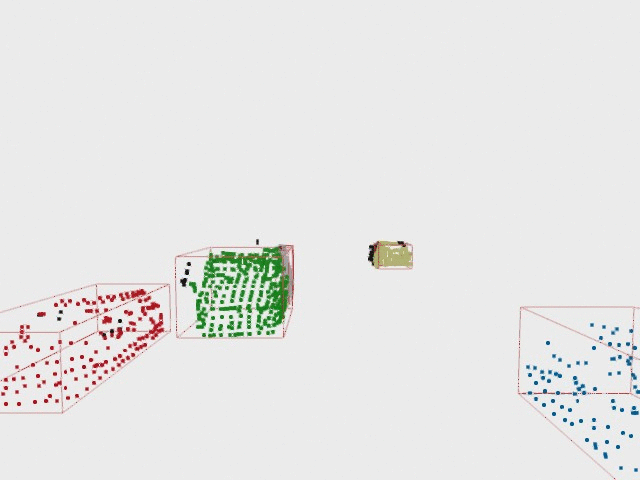

# Obstacle detection using Open3D.

This repository aims to be useful guide on how you can perform point cloud processing using the Open3D library in Python, with scripts and with notebooks. The processing here used is a simple but useful analysis of pcd files to extract information.

Files:
- **render**: final state of processing for each lidar reading.
- **sensors/data_1**: pcd files (lidar readings)
- **poetry.lock**: necessary packages to run the example
- **processing.py**: step-by-step processing script
- **lidar_thread.py**: using the Open3D's Application GUI we create a visualization window to see the whole sensor reading and processing sequence
- **lidar_processing.ipynb**: step-by-step processing python notebook

Processing steps:
1. Filtering the initial point cloud. Using voxel grid filtering, we reduce the number of points in the point cloud.
2. Cropping points outside the region of interest.
3. Removing points that belong to the "car's" roof.
4. Separating the road from obstacles. We perform Plane segmentation to achieve this goal. Using the RANSAC algorithm we can find the plane with the largest support in the point cloud.
5. Applying clustering to split the input point cloud. We separate each detected obstacle and get its correspondent points using the DBScan Algorithm.
6. Determining and drawing the bounding boxes for the obstacles in the point cloud.

Special mention:
- Special thanks to Udacity to provide this useful .pcd lidar sensor readings: https://github.com/udacity/SFND_Lidar_Obstacle_Detection